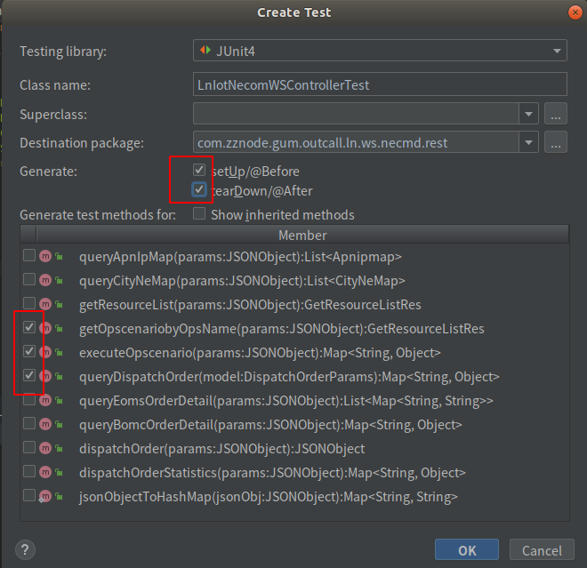

# 1 概述

​		JUnit 是一个**回归测试框架**，被开发者用于实施对应用程序的单元测试，加快程序编制速度，同时提高编码的质量。

JUnit 测试框架具有以下重要特性：

- 测试工具
- 测试套件
- 测试运行器
- 测试分类

## 1.1 Junit 基础使用

### 1.1.1 加入依赖

```xml
		<dependency>
		    <groupId>junit</groupId>
		    <artifactId>junit</artifactId>
		    <scope>test</scope>
            <version>4.12</version>
		</dependency>
```

### 1.1.2 创建测试类和测试方法

1. 测试类的的命名规则一般是 `xxxTest.java` ；
2. 测试类中测试的方法可以有前缀，这个看统一标准，所以有时候会发现别人的测试方法上有`test`前缀；
3. 并且测试方法上加上注解 `@Test`。

在要测试的类中，快捷键（Crtl+Shift+t）打开界面，选择Create New Test


在弹出的界面中选择要测试的方法。



点击完成后，在src/test目录下生成测试类。

```java
@SpringBootTest
//由于是Web项目，Junit需要模拟ServletContext，因此我们需要给我们的测试类加上@WebAppConfiguration。
@WebAppConfiguration
public class LnOnlineComplaintWSControllerTest {

  @Before
  public void setUp() throws Exception {
    System.out.println("开始测试-------------");
  }

  @After
  public void tearDown() throws Exception {
    System.out.println("结束测试-------------");
  }

  @Test
  public void queryIsSnNumber() {}
}
```

## 1.2 JUnit中的注解

* @BeforeClass：针对所有测试，只执行一次，且必须为static void

* @Before：初始化方法，执行当前测试类的每个测试方法前执行。

* @Test：测试方法，在这里可以测试期望异常和超时时间

* @After：释放资源，执行当前测试类的每个测试方法后执行

* @AfterClass：针对所有测试，只执行一次，且必须为static void

* @Ignore：忽略的测试方法（只在测试类的时候生效，单独执行该测试方法无效）

* @RunWith:可以更改测试运行器 ，缺省值 org.junit.runner.Runner

  ​	

  **一个单元测试类执行顺序为：**

@BeforeClass –> @Before –> @Test –> @After –> @AfterClass

​		**每一个测试方法的调用顺序为：**

@Before –> @Test –> @After


### 1.2.1 超时测试

​		如果一个测试用例比起指定的毫秒数花费了更多的时间，那么 Junit 将自动将它标记为失败。`timeout` 参数和 `@Test`注释一起使用。现在让我们看看活动中的 `@test(timeout)`。

```java
  @Test(timeout = 3000)
  public void queryIsSnNumber() {
    try {
      Thread.sleep(5000);
    } catch (InterruptedException e) {
      e.printStackTrace();
    }
    System.out.println("Complete");
  }
```

​		右键run该方法，运行结果如下：

```shell
开始测试-------------
结束测试-------------
java.lang.InterruptedException: sleep interrupted
	at java.lang.Thread.sleep(Native Method)
	at com.zznode.gum.outcall.ln.ws.onlineComplaint.rest.LnOnlineComplaintWSControllerTest.queryIsSnNumber(LnOnlineComplaintWSControllerTest.java:30)
	at sun.reflect.NativeMethodAccessorImpl.invoke0(Native Method)
	at sun.reflect.NativeMethodAccessorImpl.invoke(NativeMethodAccessorImpl.java:62)
	at sun.reflect.DelegatingMethodAccessorImpl.invoke(DelegatingMethodAccessorImpl.java:43)
	at java.lang.reflect.Method.invoke(Method.java:498)
	at org.junit.runners.model.FrameworkMethod$1.runReflectiveCall(FrameworkMethod.java:50)
	at org.junit.internal.runners.model.ReflectiveCallable.run(ReflectiveCallable.java:12)
	at org.junit.runners.model.FrameworkMethod.invokeExplosively(FrameworkMethod.java:47)
	at org.junit.internal.runners.statements.InvokeMethod.evaluate(InvokeMethod.java:17)
	at org.junit.internal.runners.statements.FailOnTimeout$CallableStatement.call(FailOnTimeout.java:298)
	at org.junit.internal.runners.statements.FailOnTimeout$CallableStatement.call(FailOnTimeout.java:292)
	at java.util.concurrent.FutureTask.run(FutureTask.java:266)
	at java.lang.Thread.run(Thread.java:748)
Complete

org.junit.runners.model.TestTimedOutException: test timed out after 3000 milliseconds

	at java.lang.Thread.sleep(Native Method)
	at com.zznode.gum.outcall.ln.ws.onlineComplaint.rest.LnOnlineComplaintWSControllerTest.queryIsSnNumber(LnOnlineComplaintWSControllerTest.java:30)
	at sun.reflect.NativeMethodAccessorImpl.invoke0(Native Method)
	at sun.reflect.NativeMethodAccessorImpl.invoke(NativeMethodAccessorImpl.java:62)
	at sun.reflect.DelegatingMethodAccessorImpl.invoke(DelegatingMethodAccessorImpl.java:43)
	at java.lang.reflect.Method.invoke(Method.java:498)
	at org.junit.runners.model.FrameworkMethod$1.runReflectiveCall(FrameworkMethod.java:50)
	at org.junit.internal.runners.model.ReflectiveCallable.run(ReflectiveCallable.java:12)
	at org.junit.runners.model.FrameworkMethod.invokeExplosively(FrameworkMethod.java:47)
	at org.junit.internal.runners.statements.InvokeMethod.evaluate(InvokeMethod.java:17)
	at org.junit.internal.runners.statements.FailOnTimeout$CallableStatement.call(FailOnTimeout.java:298)
	at org.junit.internal.runners.statements.FailOnTimeout$CallableStatement.call(FailOnTimeout.java:292)
	at java.util.concurrent.FutureTask.run(FutureTask.java:266)
	at java.lang.Thread.run(Thread.java:748)

```

超过3秒的时限，则会提示错误`org.junit.runners.model.TestTimedOutException: test timed out after 3000 milliseconds`

### 1.2.2 异常测试

​		可以测试代码是否它抛出了想要得到的异常。expected 参数和 @Test 注释一起使用。现在让我们看看活动中的 `@Test(expected)`。

```java
  @Test(expected = NullPointerException.class)
  public void getUserName() {
    String nullstr = null;
    if (nullstr.length()>0) {
      System.out.println("Complete");
    }
  }
```

运行结果:

```shell
开始测试-------------
结束测试-------------
Process finished with exit code 0
```

修改为非`NullPointerException`后：

```java
  @Test(expected = NullPointerException.class)
  public void getUserName() {
    String[] nullstr = {"a","b"};
    if ("c".equals(nullstr[3])) {
      System.out.println("Complete");
    }
  }
```

提示错误：

```shell
开始测试-------------
结束测试-------------
java.lang.Exception: Unexpected exception, expected<java.lang.NullPointerException> but was<java.lang.ArrayIndexOutOfBoundsException>

	at org.junit.internal.runners.statements.ExpectException.evaluate(ExpectException.java:28)
	at org.junit.internal.runners.statements.RunBefores.evaluate(RunBefores.java:26)
	at org.junit.internal.runners.statements.RunAfters.evaluate(RunAfters.java:27)
	at org.junit.runners.ParentRunner.runLeaf(ParentRunner.java:325)
	at org.junit.runners.BlockJUnit4ClassRunner.runChild(BlockJUnit4ClassRunner.java:78)
	at org.junit.runners.BlockJUnit4ClassRunner.runChild(BlockJUnit4ClassRunner.java:57)
	at org.junit.runners.ParentRunner$3.run(ParentRunner.java:290)
	at org.junit.runners.ParentRunner$1.schedule(ParentRunner.java:71)
	at org.junit.runners.ParentRunner.runChildren(ParentRunner.java:288)
	at org.junit.runners.ParentRunner.access$000(ParentRunner.java:58)
	at org.junit.runners.ParentRunner$2.evaluate(ParentRunner.java:268)
	at org.junit.runners.ParentRunner.run(ParentRunner.java:363)
	at org.junit.runner.JUnitCore.run(JUnitCore.java:137)
	at com.intellij.junit4.JUnit4IdeaTestRunner.startRunnerWithArgs(JUnit4IdeaTestRunner.java:68)
	at com.intellij.rt.execution.junit.IdeaTestRunner$Repeater.startRunnerWithArgs(IdeaTestRunner.java:47)
	at com.intellij.rt.execution.junit.JUnitStarter.prepareStreamsAndStart(JUnitStarter.java:242)
	at com.intellij.rt.execution.junit.JUnitStarter.main(JUnitStarter.java:70)
Caused by: java.lang.ArrayIndexOutOfBoundsException: 3
	at com.zznode.gum.outcall.ln.ws.onlineComplaint.rest.LnOnlineComplaintWSControllerTest.getUserName(LnOnlineComplaintWSControllerTest.java:40)
	at sun.reflect.NativeMethodAccessorImpl.invoke0(Native Method)
	at sun.reflect.NativeMethodAccessorImpl.invoke(NativeMethodAccessorImpl.java:62)
	at sun.reflect.DelegatingMethodAccessorImpl.invoke(DelegatingMethodAccessorImpl.java:43)
	at java.lang.reflect.Method.invoke(Method.java:498)
	at org.junit.runners.model.FrameworkMethod$1.runReflectiveCall(FrameworkMethod.java:50)
	at org.junit.internal.runners.model.ReflectiveCallable.run(ReflectiveCallable.java:12)
	at org.junit.runners.model.FrameworkMethod.invokeExplosively(FrameworkMethod.java:47)
	at org.junit.internal.runners.statements.InvokeMethod.evaluate(InvokeMethod.java:17)
	at org.junit.internal.runners.statements.ExpectException.evaluate(ExpectException.java:19)
	... 16 more
```

### 1.2.3 套件测试

将多个组件一起测试：

```java
public class TaskOneTest {
    @Test
    public void test() {
        System.out.println("Task one do.");
    }
}

public class TaskTwoTest {
    @Test
    public void test() {
        System.out.println("Task two do.");
    }
}

public class TaskThreeTest {
    @Test
    public void test() {
        System.out.println("Task Three.");
    }
}

@RunWith(Suite.class) // 1. 更改测试运行方式为 Suite
// 2. 将测试类传入进来
@Suite.SuiteClasses({TaskOneTest.class, TaskTwoTest.class, TaskThreeTest.class})
public class SuitTest {
    /**
     * 测试套件的入口类只是组织测试类一起进行测试，无任何测试方法，
     */
}
```

### 1.2.4 参数化测试

​		Junit 4 引入了一个新的功能参数化测试。参数化测试允许开发人员使用不同的值反复运行同一个测试。你将遵循 5 个步骤来创建参数化测试。

* 用 @RunWith(Parameterized.class)来注释 test 类。
* 创建一个由 @Parameters 注释的公共的静态方法，它返回**一个对象的集合(数组)**来作为测试数据集合。
* 创建一个公共的构造函数，它接受和一行测试数据相等同的东西。
* 为每一列测试数据创建一个实例变量。
* 用实例变量作为测试数据的来源来创建你的测试用例。

```java
//1.更改默认的测试运行器为RunWith(Parameterized.class)
@RunWith(Parameterized.class)
public class ParameterTest {
    // 2.声明变量存放预期值和测试数据
    private String firstName;
    private String lastName;

    //3.声明一个返回值 为Collection的公共静态方法，并使用@Parameters进行修饰
    @Parameterized.Parameters //
    public static List<Object[]> param() {
        // 这里我给出两个测试用例
        return Arrays.asList(new Object[][]{{"Mike", "Black"}, {"Cilcln", "Smith"}});
    }

    //4.为测试类声明一个带有参数的公共构造函数，并在其中为之声明变量赋值
    public ParameterTest(String firstName, String lastName) {
        this.firstName = firstName;
        this.lastName = lastName;
    }
    // 5. 进行测试，发现它会将所有的测试用例测试一遍
    @Test
    public void test() {
        String name = firstName + " " + lastName;
        assertThat("Mike Black", is(name));
    }
}
```

# 2 Spring Boot 中使用 JUnit

​		Spring 框架提供了一个专门的测试模块（spring-test），用于应用程序的集成测试。 在 Spring Boot 中，你可以通过spring-boot-starter-test启动器快速开启和使用它。

## 2.1 加入依赖

```java
<dependency>
    <groupId>org.springframework.boot</groupId>
    <artifactId>spring-boot-starter-test</artifactId>
    <scope>test</scope>
</dependency>
```

## 2.2 Spring Boot 测试

​		一般的Springboot中Service类的测试

```java
// 获取启动类，加载配置，确定装载 Spring 程序的装载方法，它回去寻找 主配置启动类（被 @SpringBootApplication 注解的）
@SpringBootTest(classes = com.zznode.SpringBootStart.class)
// 让 JUnit 运行 Spring 的测试环境， 获得 Spring 环境的上下文的支持
@RunWith(SpringRunner.class)
public class LnOnlineComplaintWSServiceTest {

    @Autowired
    private LnOnlineComplaintWSService lnOnlineComplaintWSService;

    @Before
    public void setUp() throws Exception {
        System.out.println("开始测试-------------");
    }


    @After
    public void tearDown() throws Exception {
        System.out.println("结束测试-------------");
    }

    @Test
    public void queryIsSnNumber() {
        Map<String, String> map = new HashMap<>();
        map.put("idcard","18116679581");
        List<Map<String,Object>> retList = lnOnlineComplaintWSService.queryIsSnNumber(map);
    }
}
```

​		首先注意两个注解`@SpringBootTest`和`@RunWith(SpringRunner.class)`的使用，引入此注解后，在测试类中才可以`@Autowired`要测试的类。

​		另外请格外注意，如果项目是多module的项目，而你要测试的类不在主项目中（即注解`@SpringBootTest(classes = com.zznode.SpringBootStart.class)`无法引用到项目的启动类SpringBootStart），这时测试类`LnOnlineComplaintWSServiceTest`就要放置到主项目中的`src/test`目录下


参考网址:

* [学习 Spring Boot：（二十九）Spring Boot Junit 单元测试](https://blog.csdn.net/qq_35915384/article/details/80227297)