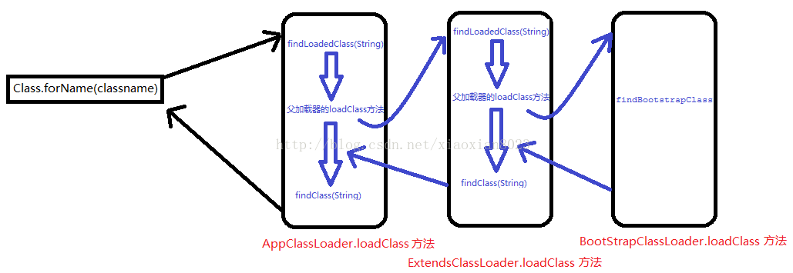
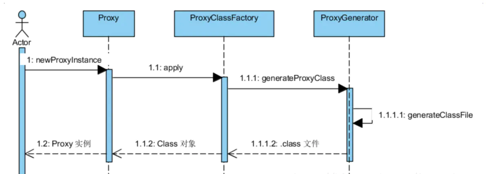

## 1 反射

> 反射库是一个非常丰富且精心设计的工具集，可以方便的是我们来动态操纵Java代码。反射机制可以用来：

* 在运行时分析类的能力
* 在运行时查看对象，例如，编写一个`toString`方法供所有类使用
* 实现通用的数组操作代码
* 利用Method对象，这个对象很像C++中的函数指针

### 1.1 Class类

​		Java程序在运行时，Java运行时系统一直对所有的对象进行所谓的运行时类型标识，即所谓的RTTI。这项信息纪录了每个对象所属的类。虚拟机通常使用运行时类型信息选准正确方法去执行，用来保存这些类型信息的类是Class类。Class类封装一个对象和接口运行时的状态，当装载类时，Class类型的对象自动创建。

* Class类也是类的一种，只是名字和class关键字高度相似。Java是大小写敏感的语言。
* Class类的对象内容是你创建的类的类型信息，比如你创建一个shapes类，那么，Java会生成一个内容是shapes的Class类的对
* Class类的对象不能像普通类一样，以 new shapes() 的方式创建，它的对象只能由JVM创建，因为这个类没有public构造函数
* Class类的作用是运行时提供或获得某个对象的类型信息，和C++中的`typeid()`函数类似。这些信息也可用于反射。

#### 1.1.1 Class原理

​		所有的Java类都是继承了object这个类，在object这个类中有一个方法：`getclass()`。这个方法是用来取得该类已经被实例化了的对象的该类的引用，这个引用指向的是Class类的对象。我们自己无法生成一个Class对象（**构造函数为private**)，而 这个Class类的对象是在当各类被调入时，由 Java 虚拟机自动创建 Class 对象，或通过类装载器中的 `defineClass` 方法生成。我们生成的对象都会有个字段记录该对象所属类在Class类的对象的所在位置。

#### 1.1.2 获得Class对象

* 第一种办法，Class类的`forName`函数

```java
public class shapes{}  
Class obj= Class.forName("shapes");
```

* 第二种办法，使用对象的`getClass()`函数

```java
public class shapes{}
shapes s1=new shapes();
Class obj=s1.getClass();
Class obj1=s1.getSuperclass();//这个函数作用是获取shapes类的父类的类型
```

* 第三种办法，使用类字面常量

```java
Class obj=String.class;
Class obj1=int.class;
```

​		注意，使用这种办法生成Class类对象时，不会使JVM自动加载该类（如String类）。而其他办法会使得JVM初始化该类。

#### 1.1.3 使用Class生成实例

​		生成不精确的object实例，获取一个Class类的对象后，可以用 `newInstance() `函数来生成目标类的一个实例。然而，该函数并不能直接生成目标类的实例，只能生成object类的实例

```java
Class  obj = Class.forName("shapes");
Object  ShapesInstance=obj.newInstance();
```

#### 1.1.4 泛型

* 使用泛化Class语法的对象引用指向特定类

```java
Class<shapes> obj=shapes.class;
shapes newShape=obj.newInstance();
```

* 使Class的对象指向基类的任何子类。

```java
Class</ extends Number> obj=int.class;
obj=Number.class;
obj=double.class;
```

* 以下语法生成的Class对象可以指向任何类。

```java
Class</> obj=int.class;
obj=double.class;
obj=shapes.class;
```

​		当你使用这种泛型语法来构建你手头有的一个Class类的对象的基类对象时，必须采用以下的特殊语法。

```java
public class shapes{}
class round extends shapes{}
Class<round> rclass=round.class;
Class</ super round> sclass= rclass.getSuperClass();
//Class<shapes> sclass=rclass.getSuperClass();
```

我们明知道，round的基类就是shapes，但是却不能直接声明 `Class < shapes >`，必须使用特殊语法。

代码示例：

```
JavaLearning：com.prd.reflect.ReflectClassTest
```

### 1.2.反射概述

​		反射机制指的是程序在运行时能够获取自身的信息。在Java中，只要给定类的名字，那么就可以通过反射机制来获得类的所有信息。
​	每个Java程序执行前都必须经过编译、加载、连接、和初始化这几个阶段，后三个阶段如:

* 加载：查找并加载类的二进制数据

* 连接：
  * -验证：确保被加载的类的正确性
  * -准备：为类的静态变量分配内存，并将其初始化为默认值
  * -解析：把类中的符号引用转换为直接引用

* 初始化：为类的静态变量赋予正确的初始化值

 ####  1.2.1 加载

​		加载是指将编译后的Ｊava类文件（也就是.class文件）中的二进制数据读入内存，并将其放在运行时数据区的方法区内，然后在**堆区**创建一个`java.lang.Class`对象，用来封装类在方法区的数据结构。即加载后最终得到的是Class对象，并且更加值得注意的是：该`java.lang.Class`对象是**单实例**的，无论这个类创建了多少个对象，他的Class对象时唯一的。加载并获取该Class对象可以通过三种途径（如1.1.2节）。
​		另外，类加载时类中的静态代码块会得到执行。

#### 1.2.2 连接和初始化

​		在连接和初始化阶段，其实静态变量经过了两次赋值：第一次是静态变量类型的默认值；第二次是我们真正赋给静态变量的值。

#### 1.2.3 使用

​		Java对类的使用分为两种方式：**主动使用**和**被动使用**。其中主动使用如下，而类的初始化时机正是Java程序对类的首次主动使用，除了以下6种方式，其他对类的使用都是被动使用，都不会导致类的初始化。

​		**主动使用(6种)：**

1. 创建类的实例

2. 访问某个类或接口的静态变量，或者对该静态变量赋值

3. 调用类的静态方法

4. 反射（`Class.forName(...)`）

5. 初始化一个类的子类

6. Java虚拟机启动时被标明为启动类的类

​		 **注意**

1. 调用`ClassLoader.loadClass`加载一个类，并不是对类的主动使用，不会导致类的初始化。

2. 当Java虚拟机初始化一个类时，要求他的所有父类都已经被初始化，但是这条规则并不适用于接口。在初始化一个类时，并不会先初始化它所实现的接口；在初始化一个接口时，并不会先初始化它的父接口

   因此，一个父接口并不会因为它的子接口或者实现类的初始化而初始化，只有当程序首次使用特定接口的静态变量时，才会导致该接口的初始化。

### 1.3 `Class.forName`解析

​		`Class.forName(classname)`方法,实际上是调用了Class类中的 `Class.forName(classname, true, currentLoader)`方法。

​		参数：

* name - 所需类的完全限定名；

* initialize - 是否必须初始化类；

* loader - 用于加载类的类加载器。`currentLoader`则是通过调用`ClassLoader.getCallerClassLoader()`获取当前类加载器的。类要想使用，必须用类加载器加载，所以需要加载器。反射机制，不是每次都去重新反射，而是提供了cache，每次都会需要类加载器去自己的cache中查找，如果可以查到，则直接返回该类。

  ​	**`ClassLoader`的`loadClass`机制：**



​		先检查自己是否已经加载过该类，如果加载过，则直接返回该类，若没有则调用父类的`loadClass`方法，如果父类中没有，则执行`findClass`方法去尝试加载此类，也就是我们通常所理解的片面的"反射"了。这个过程主要通过`ClassLoader.defineClass`方法来完成。`defineClass` 方法将一个字节数组转换为 Class 类的实例（任何类的对象都是Class类的对象）。这种新定义的类的实例需要使用 `Class.newInstance` 来创建，而不能使用new来实例化。

### 1.4 `Class.forName`与`ClassLoader.loadClass`区别

​		Java中`class.forName()`和`classLoader`都可用来对类进行加载。`class.forName()`前者除了将类的.class文件加载到jvm中之外，还会对类进行解释，执行类中的static块。而`ClassLoader`只干一件事情，就是将.class文件加载到JVM中，不会执行static中的内容,只有在`newInstance`才会去执行static块。`Class.forName(name, initialize, loader)`带参函数也可控制是否加载static块。并且只有调用了`newInstance()`方法采用调用构造函数，创建类的对象

### 1.5 常用API

获得构造函数的方法 

```java
Constructor getConstructor(Class[] params)//根据指定参数获得public构造器
Constructor[] getConstructors()//获得public的所有构造器
Constructor getDeclaredConstructor(Class[] params)//根据指定参数获得public和非public的构造器
Constructor[] getDeclaredConstructors()//获得public的所有构造器 
```

获得类方法的方法 

```java
Method getMethod(String name, Class[] params),根据方法名，参数类型获得方法.其中Class[]为参数的类类型，基本类型的类由其各自包装器的特殊的静态TYPE字段来表示：Integer.TYPE 。
Method[] getMethods()//获得所有的public方法
Method getDeclaredMethod(String name, Class[] params)//根据方法名和参数类型，获得public和非public的方法
Method[] getDeclaredMethods()//获得所以的public和非public方法 
使用Method对象的invoke()方法，将调用我们的目标方法，并将结果返回为一个Object。如果方法返回void，invoke()就会返回一个java.lang.Void对象。这是一个表示void返回值的包装器类。    
```

获得类中属性的方法 

```java
Field getField(String name)//根据变量名得到相应的public变量
Field[] getFields()//获得类中所以public的方法
Field getDeclaredField(String name)//根据方法名获得public和非public变量
Field[] getDeclaredFields()//获得类中所有的public和非public方法 
```

### 1.6 反射数组

​		利用反射API可以使用`java.lang.reflect.Array`类创建和检查基类型的数组。其主要特性是Array中一个名为`newInstance()`的静态方法，它将创建一个数组，从而可以指定基类型和长度。还可以通过指定一个长度数组（每个长度对应一个维）并用此方法来构造多维数组实例。

代码示例：

```java
JavaLearning：com.prd.reflect.ReflectArrayTest
```

## 2 代理　

​		代理就是在程序运行过程中，对于一个或一组给定的接口，动态生成这些接口的实例，并实现对这些实例的控制和使用。例如：在某个接口的方法运行前后添加监控日志等。从实现上来说，代理可以分为静态代理和动态代理。

### 2.1 静态代理

​		创建一个接口，然后创建被代理的类实现该接口并且实现该接口中的抽象方法。之后再创建一个代理类，同时使其也实现这个接口。在代理类中持有一个被代理对象的引用，而后在代理类方法中调用该对象的方法。

代码示例：

```java
JavaLearning：com.prd.reflect.StaticProxyTest
```

​		使用静态代理很容易就完成了对一个类的代理操作。但是静态代理的缺点也暴露了出来：由于代理只能为一个类服务，如果需要代理的类很多，那么就需要编写大量的代理类，比较繁琐。。接下来可以看下动态代理。

### 2.2 动态代理

​		动态代理是在运行过程中，利用反射机制实现的。实现动态代理的步骤：

* 首先，要提供一个调用处理器，需 实现`InvocationHandler`接口

* 其次，就是通过Proxy类的静态方法`newProxyInstance`返回一个接口的代理实例。

* 最后，执行代理实例的方法。

代理示例：

```java
JavaLearning：com.prd.reflect.DynamicProxyTest
```

#### 2.2.1 动态代理底层实现

​		动态代理具体步骤：

* 通过实现` InvocationHandler` 接口创建自己的调用处理器；

* 通过为 Proxy 类指定` ClassLoader` 对象和一组` interface` 来创建动态代理类；

* 通过反射机制获得动态代理类的构造函数，其唯一参数类型是调用处理器接口类型；

* 通过构造函数创建动态代理类实例，构造时调用处理器对象作为参数被传入。

  既然生成代理对象是用的Proxy类的静态方`newProxyInstance`，那么我们就去它的源码里看一下它到底都做了些什么？

  详细讲解可以参考如下网址：[JAVA动态代理](https://www.jianshu.com/p/9bcac608c714)


​       动态代理生成的代理类是在内存中存在的，如果需要学习代理类的源码，可以设置如下：`System.getProperties().put("sun.misc.ProxyGenerator.saveGeneratedFiles", "true");    `。在运行代码的时候就会在项目的根目录下生成 `com.sun.proxy.$ProxyX.class` 了，我们可以通过反编译来理解 Proxy 的处理过程。

​      也可以通过`Proxy.getProxyClass(真正用到的类.class.getClassLoader(), 真正用到的类.class)); `来获取字节码，然后写到本地。参考（[如何查看 Proxy 模式的 $ProxyX.class文件](https://blog.csdn.net/niuzhucedenglu/article/details/82970897)）

​		动态代理流程图：

